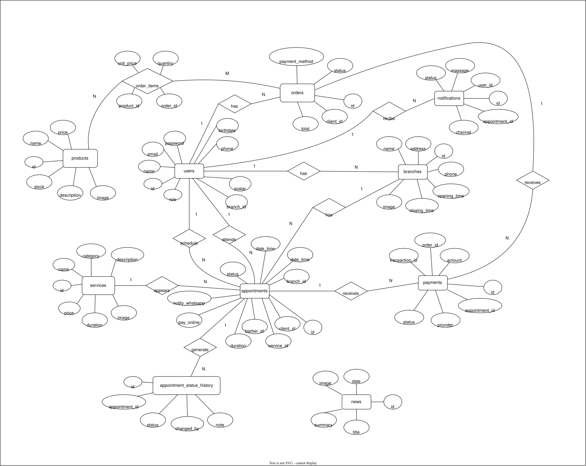

# Sistema Barbería

## Integrantes

- Jose Daniel Cruz Barrera 
- José Ramos David Efraín

## Descripción del proyecto

Muchas barberías gestionan sus citas, catálogo de servicios/productos y comunicación con clientes de forma manual (WhatsApp personal, libretas o agendas físicas), lo que provoca traslapes de horario, olvidos de confirmación, falta de visibilidad del historial de cada cliente y nula trazabilidad para el dueño del negocio sobre qué barbero atiende qué citas.

Este proyecto resuelve esa problemática con una aplicación web full stack que permite:

- A los **clientes**: consultar servicios, productos, sucursales y noticias, agendar citas en línea, dar seguimiento a sus propias citas y recibir confirmaciones automáticas.
- A los **administradores/barberos**: gestionar el calendario de citas con filtros y paginación, aceptar, posponer o cancelar citas, y llevar el historial de cada cliente.
- Al sistema en general: notificar por correo, SMS y WhatsApp de forma automática ante cada acción relevante (cita creada, confirmada o reprogramada), evitando la gestión manual y los errores humanos que esto conlleva.

## Diagrama entidad relacion del sistema
   

## Test de la api

Repositorio de GitHub: `https://github.com/DanielCB-T/api-sistema-barberia`

## 1. Arranque rápido

```bash
composer install
cp .env.example .env
php artisan key:generate
# edita .env con tu MySQL: DB_DATABASE, DB_USERNAME, DB_PASSWORD
php artisan migrate:fresh --seed
php artisan serve
```

Base URL local: `http://127.0.0.1:8000/api`

Headers recomendados en **todas** las peticiones:
```
Accept: application/json
Content-Type: application/json
```

En las rutas protegidas, además:
```
Authorization: Bearer <token>
```

---

## 2. Usuarios de prueba (generados por el seeder)

| Rol | Email | Password | Notas |
|---|---|---|---|
| Admin (cuenta de evaluación) | `developer@barberia.com` | `Developer123!` | Fija para el profesor, no modificarla |
| Admin | `admin@barberia.com` | `Admin123!` | |
| Cliente | `user@barberia.com` | `Client123!` | Tiene citas y pedidos de ejemplo (seeder) |
| Barbero | `barbero1@barberia.com` | `Barbero123!` | Asignado a la sucursal 1 (Barbería Centro) |
| Barbero | `barbero2@barberia.com` | `Barbero123!` | Asignado a la sucursal 2 (Barbería Reforma) |

Hay además ~10 clientes y algunos barberos extra generados con Faker (contraseña `password` para todos los usuarios de Faker) — útiles para probar paginación y filtros con volumen.

---

## 3. Autenticación

### `POST /api/register` — público
Crea un cliente nuevo.

```json
{
  "name": "Ana Torres",
  "email": "ana@example.com",
  "phone": "9511234567",
  "birthdate": "1998-05-20",
  "password": "Segura123!",
  "password_confirmation": "Segura123!"
}
```
`201` con `user` y `token`. `422` si el email ya existe o el password no cumple la política (8+ caracteres, mayúscula, minúscula, número, símbolo).

### `POST /api/login` — público
```json
{ "email": "user@barberia.com", "password": "Client123!" }
```
`200` con `user` y `token`. `422` si las credenciales son incorrectas.

### `POST /api/forgot-password` — público
```json
{ "email": "user@barberia.com" }
```
`200`. El correo queda en `storage/logs/laravel.log` (`MAIL_MAILER=log`), no se envía uno real todavía.

### `POST /api/reset-password` — público
```json
{
  "token": "<token del log>",
  "email": "user@barberia.com",
  "password": "NuevaSegura123!",
  "password_confirmation": "NuevaSegura123!"
}
```

### `GET /api/user` — requiere token
Regresa el usuario autenticado.

### `POST /api/logout` — requiere token
Revoca el token con el que se hizo la petición.

---

## 4. Usuarios

### `GET /api/users` — requiere token, **solo admin**
Query params opcionales: `role` (`admin`|`client`|`barber`), `per_page`.
```
GET /api/users?role=barber&per_page=10
```
`403` si el token es de un cliente o barbero.

### `GET /api/users/{id}` — requiere token, admin o el propio usuario
`403` si intentas ver el perfil de alguien más sin ser admin. La respuesta nunca incluye `password`.

---

## 5. Servicios (catálogo)

### `GET /api/services` — público
Query params opcionales: `category`, `per_page`, `page`.
```
GET /api/services?category=Corte&per_page=10
```

### `GET /api/services/{id}` — público
`404` si el id no existe.

### `POST /api/services` — requiere token, **solo admin**
```json
{
  "name": "Corte + barba",
  "category": "Degradado",
  "price": 220,
  "duration": 60,
  "description": "Paquete completo",
  "image": "https://ejemplo.com/img.jpg"
}
```
`201`. `422` si falta `name`, `price` no es numérico, etc. `403` si el token no es de admin.

### `PUT /api/services/{id}` — requiere token, **solo admin**
Mismos campos que store, todos opcionales.

### `DELETE /api/services/{id}` — requiere token, **solo admin**

---

## 6. Citas

Reglas de visibilidad (aplicadas automáticamente por el controlador según el rol del token):
- **Cliente:** solo ve/edita sus propias citas.
- **Barbero:** solo ve/edita las citas asignadas a él.
- **Admin:** ve y edita todas.

### `GET /api/appointments` — requiere token
Query params opcionales: `status`, `branch_id`, `date_from`, `date_to`, `per_page`.
```
GET /api/appointments?status=pendiente&date_from=2026-07-01&date_to=2026-07-31&per_page=10
```

### `POST /api/appointments` — requiere token (rol cliente)
```json
{
  "service_id": 1,
  "branch_id": 1,
  "barber_id": 6,
  "date_time": "2026-08-15 11:00:00",
  "pay_online": true,
  "notify_whatsapp": true
}
```
`201`, estado inicial `pendiente`. `422` si `date_time` no es futura o algún id no existe.

### `GET /api/appointments/{id}` — requiere token, dueño/barbero asignado/admin
Incluye `history` con la bitácora de cambios de estado. `403` si la cita no es tuya.

### `PUT /api/appointments/{id}` — requiere token, dueño/barbero asignado/admin
Reprogramar fecha, servicio o barbero. Solo si la cita está `pendiente` o `confirmada`.
```json
{ "date_time": "2026-08-16 12:00:00" }
```
`422` si la cita ya está `completada` o `cancelada`.

### `PATCH /api/appointments/{id}/status` — requiere token
Único endpoint para cambiar el estado.
```json
{ "status": "confirmada", "note": "Confirmada por el barbero" }
```

**Máquina de estados:**

| Estado actual | Puede pasar a |
|---|---|
| `pendiente` | `confirmada`, `pospuesta`, `cancelada` |
| `confirmada` | `completada`, `pospuesta`, `cancelada` |
| `pospuesta` | `confirmada`, `cancelada` |
| `completada` | *(ninguno, estado final)* |
| `cancelada` | *(ninguno, estado final)* |

- Un **cliente** solo puede mover su cita a `cancelada` (`403` si intenta otra cosa).
- Cualquier transición fuera de la tabla (ej. `cancelada → confirmada`) responde `422`.

---

## 7. Casos de prueba sugeridos para Bruno

| # | Caso | Resultado esperado |
|---|---|---|
| 1 | `POST /api/login` con `user@barberia.com` / `Client123!` | `200` + token |
| 2 | `GET /api/user` sin header `Authorization` | `401` |
| 3 | `GET /api/user` con el token del paso 1 | `200`, datos del cliente |
| 4 | `POST /api/services` con token de cliente | `403` |
| 5 | `POST /api/services` con token de `admin@barberia.com` sin `name` | `422` con `errors.name` |
| 6 | `POST /api/services` con token de admin, body completo | `201` |
| 7 | `GET /api/services/9999` | `404` |
| 8 | `POST /api/register` con password `12345678` (sin mayúscula/símbolo) | `422` con `errors.password` |
| 9 | `POST /api/appointments` (token cliente) con una fecha pasada | `422` |
| 10 | `GET /api/appointments/{id}` de una cita de otro cliente | `403` |
| 11 | `PATCH /api/appointments/{id}/status` de `cancelada` a `confirmada` | `422` |
| 12 | `PATCH /api/appointments/{id}/status` a `cancelada` (token del cliente dueño) | `200` |

---
